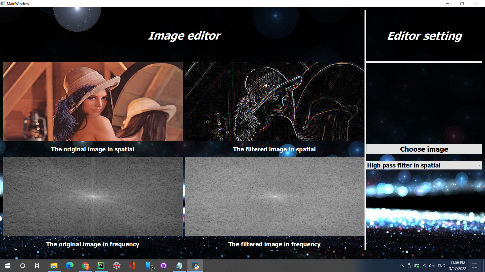

# Image filterimng on a gray or an RGB image and histogram equalization on a gray image
### Main window

#### You can browse an image from your pc by clicking the choose image button

#### Then you can choose one of the provided filters from the combo box

#### Filters provided

1. High pass filter
2. low pass filter
3. Negative laplacian filter
4. Positive laplacian filter
5. Median filter
6. Histogram equalization

### Main window with un uploaded and filtered image

### Please, note that image (9.jpg) need to be in the same directory as main.py file as it is the background of the GUI.
